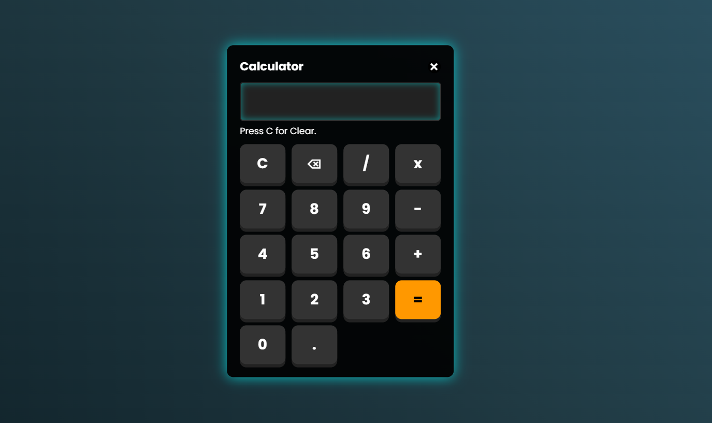

<h1 align ="center">CALCULATOR</h1>
<h2><a href="https://hyperdevil-x.github.io/Calculator/" target="_blank">Website Link</a></h2>

 <h3  align ="center"><b>Calculator using Html,Css,Javascript</b></h3>
  

This advanced calculator, built with HTML, CSS, and JavaScript, features a dynamic glowing effect. It seamlessly supports both keyboard input and mouse clicks, and offers robust drag-and-drop functionality for effortless repositioning anywhere on the screen.

<ul>
 <h1><b>Programing Languages<b></h1>
<h2><b>Front-End</b></h2>
<li>HTML5</li>
 <li>CSS3</li>
  <li>Javascript</li>
</ul>

